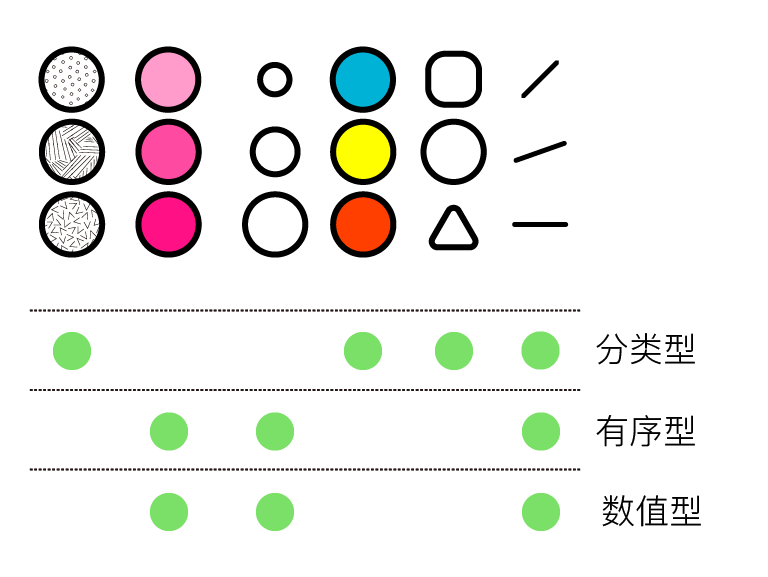

# 数据可视化(Data visualization)

### 数据类型(Data Type)：

数据可视化，是对手上的数据进行处理并转化为通熟易懂的图表。进入数据可视化的第一步，是学会理解并区分常见数据类型：

1. 定量数据（quantitative）
   * 离散型数据：数值属于某个特有的集合
   * 连续型数据：数值是某范围的任意数值
2. 分类数据（categorical)
   * 数据的某种属性（国家，性别等等）
   * 有序数据(ordinal): 某种定量数据和分类数据的混合（等级，排名，星级）
3. 时间序列数据
   * 通过一段时间的重复测量收集到的数据

### 数据视觉编码(Visual Encoding):

视觉编码是图表的重要组成元素，我们可以用有创意的方式将这些元素组合起来对数据进行可视化。

### 失真系数（Lie Factor）

失真系数是图形有效性的一个无量纲量（dimensional measure）

用于表示图表的完整性或图表展示数据的效果。理想的失真系数应该处于 0.95 ～ 1.05 之间。

$$失真系数 = \frac{图表展示差异大小}{数据展示差异大小}$$

$$差异大小 = \frac{(First Value- Second Value) 100}{First Value}$$

### 设计原则

少则是多（less is more），1 + 1 = 3

## 图形语法

图形语法是 [Leland Wilkinson](http://en.wikipedia.org/wiki/Leland_Wilkinson) 于 1999 年在同名书籍 《[图形语法](http://www.springer.com/statistics/computational+statistics/book/978-0-387-24544-7)》中首次提出的一种可视化理论。

该理论涉及范围相当广泛，影响了图形和可视化库（包括 D3 及其前驱）的发展，其中有 3 个关键原理：

1. 美学与数据的分离
2. 常见图形/图表元素的定义
3. 这些常见元素的构成

### 关注点分隔

从数据的视觉呈现中分离数据的好处。以下为主要的几点：

* 独立转换并展示数据
* 委派工作和责任
  * 工程师关注数据操纵
  * 设计人员关注数据的视觉编码
* 展示数据集的多个视觉表征
  * 不包括：气泡图和线条图呈现数据集的[不同](http://dc-js.github.io/dc.js/)分面。

### 常见元素

当你想创建图表或图形时，从视觉上分解你希望实现的目的通常很有帮助。在前几段视频中，你看到了如何将图表提取到更为基础的视觉编码中。在谈论**可组合的元素**时，最常见的就是：

- 坐标系（笛卡尔与径向/极坐标系）
- 标尺（线性、对数等）
- 文本注释
- 形状（线条、圆圈等）
- 数据类型（分类、连续等）

### 构成

当你将这些常见元素组合到一起时，你就能发现图形语法的迷人之处了。例如，你可以在笛卡尔空间中，将数据值映射到条形高度，从而创建条形图。你也可以在极坐标系中映射这些值（数据值对应到切片的径向度数），得到饼状图。

- 分类数据 + 连续数据 x 笛卡尔坐标系 = 条形图
- 分类数据 + 连续数据 x 极坐标系 = 饼状图
- 连续数据 + 连续数据 x 笛卡尔坐标系 = 散点图

### 图表类型

 