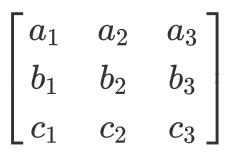
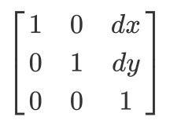

## 了解CSS变换矩阵（Transform Matrix)

### 介绍

变换矩阵函数`matrix()` 和`matrix3d()`应该是CSS3 Transforms 里面最烧脑的了。在多数情况下，你可能会使用`rotate()`,`skewY()`来实现简单的变换。但每种 Transform 都等价于一个**矩阵**。学会并理解它们的工作原理将是很帮助的。

线性代数和几何时 CSS Transform 的根基。虽然有一点高数基础将会有很大帮助，但没有高数基础要搞懂矩阵变换也不难。进入正题之前首先要确定你已经熟悉了 CSS Transform，如果没有可以看一下[CSS3 transitions and 2D transforms](https://dev.opera.com/articles/css3-transitions-and-2d-transforms/).

在这篇文章中，我将会覆盖用来实现2D转换的 3x3 矩阵和3D转换的 4x4矩阵。 

### 什么是矩阵？

矩阵只是一个花哨的数学术语。由数字，符号或表达式组成的方形数组（图1）。矩阵在数学和科学中有很多的应用。比如在物理中用来研究量子力学。在计算机世界里，可以用来将3D的物体投射到2D的屏幕上，CSS3 里的转换亦是如此。`matrix()`可以用来完成现线性转换，`matix3d()`可以用来在2维世界中模拟3D。




最重要的一点，一个变换(transform)是由变换矩阵乘以另外一个由某个点的坐标所组成的列矩阵。

### 变换和坐标系统

我们首先要讨论坐标系统。每一个文档视窗都是一个坐标系。左上角是这个坐标系统的原点`(0,0)`，Y轴向下为正，X轴向右为正。在3D变换的情况下，Z轴确定与观察者的感知距离。

当一个 Transform 应用到一个对象时，会创建一个**局部坐标系统**(Local coordinate system)--默认原点在对象的中间位置(50%, 50%)。


我们可以用`transform-origin`这个属性来改变对象坐标系统的原点。例如：`transform-origin: 50px 70px`会将对象的坐标原点移动到距对象盒子左边距50px和距对象盒子上边距70px的位置。接下来任何对象盒子内的点的变换将会基于新的原点。


任何时候你应用某个变换时，浏览器会为你完成所有复杂的计算。你只需要提供正确的参数来达到你想要的效果。

### 计算变换: 矩阵和向量

我们先看一个用3x3的矩阵来计算二维变换的例子。4x4矩阵转换是一样的工作原理，只是多了一些用于Z轴变换的数字。 


我们也可以将其以CSS形式写成`matrix(a, b, c, d, e, f)`，a到f是常量，决定了我们想要实现的变换。矩阵是实现各种变换的配方。当我们看过几个例子后，这一点将会变得更清楚明了。

我们应用一个2D变换时，浏览器用一个向量[x, y, 1]乘以这个矩阵。x，y的值是对象盒子内局部坐标系中的某一个点的坐标值。

为了决定变换后的坐标，我们将变换矩阵的行乘以列向量，得到一个用于变换的列矩阵。


前面提到过，CSS3 中的每一种变换(`rotate()``tanslate()`...)都有自己的变换矩阵。图六是`translate()`的变换矩阵。



让我们尝试将某盒子中的原点(0, 0)平移到(10, 11):


值dx 和 dy 是原点(0, 0)基于局部坐标系要唯一的值，在上图中是向右移动10个计量单位(CSS中的px)，向上移动11个计量单位。(注意与`translate-origin`的区别)。我们可以用CSS将其表示为：

```css
.translate {
    transform: matrix(1, 0, 0, 1, dx, dy);
}
```

我们现在来尝试应用`matrix()`到浏览器视窗中的元素对象，这个元素对象位于视窗左上角。


我们会将该对象沿x轴和y轴各移动150个像素。CSS：

```css
.translate {
    transform: matrix(1, 0, 0, 1, 150, 150);
}
```

顺便提一下，上面的CSS等同于`transform: translate(150px, 150px)`。让我们计算一下将该矩阵应用到点(220px, 220px)的结果。


变换（transform）是对象在局部坐标系中变换前后的映射。在视口中渲染点的位置取决于从对象的起始位置应用的变换偏移。浏览器视窗中渲染的某个对象的某个点的位置取决于应用的变换和它的初始位置。下面是变换后的样子。


### 3D变换的计算

上面我们说完了 3x3 变换矩阵。现在试一下用4x4矩阵来实现缩放。


这里的 sx, sy 和sz 代表着各个轴的缩放。可以用 matrix3d 函数写为`transform: matrix3d(sx, 0, 0, 0, 0, sy, 0, 0, 0, 0, sz, 0, 0, 0, 0, 1)`。

接着我们上面的例子，我们将要用`matrix3d()`函数来实现 x轴和y轴的缩放。

```css
.scale {
    transform: matrix3d(.8, 0, 0, 0, 0, .5, 0, 0, 0, 0, 1, 0, 0, 0, 0, 1)
}
```

上面应用的变换矩阵等同于`matrix3d(.8, .5, 1)`。因为只是在x轴和y轴上缩放，我们也可以用`matrix(.8, 0, 0, .5, 0, 0)`和`scale(.8, .5)`来实现同样的效果。


4x4矩阵的计算跟3x3矩阵的计算一样:

